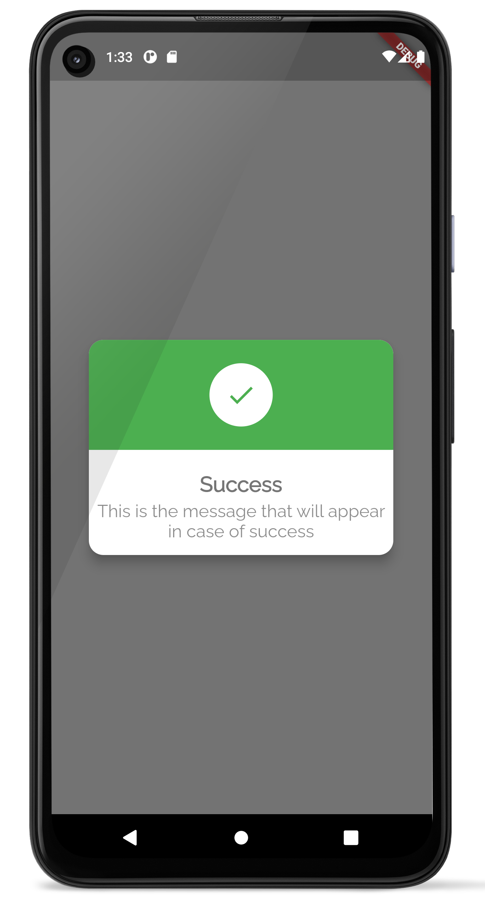
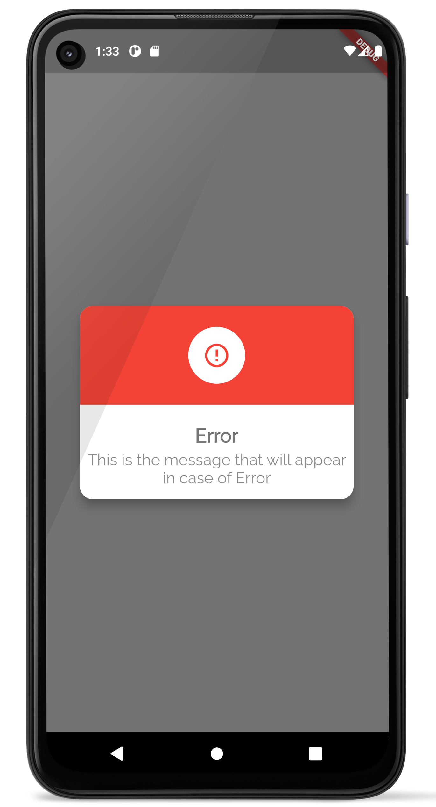
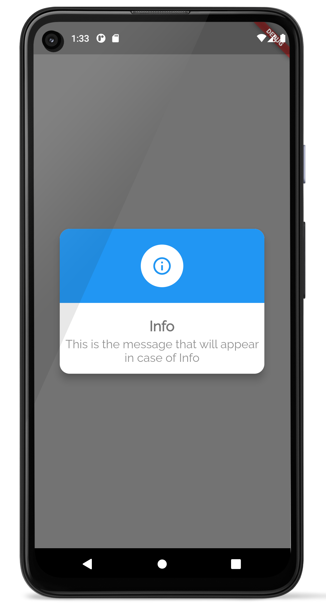
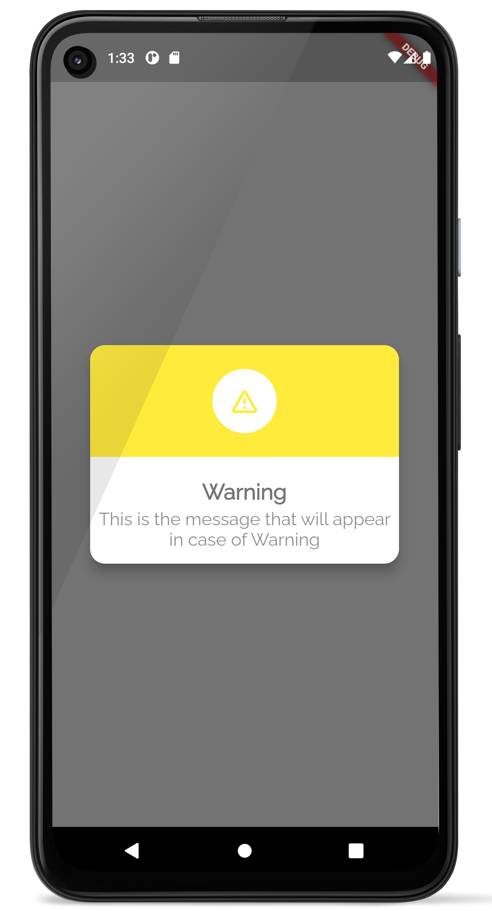
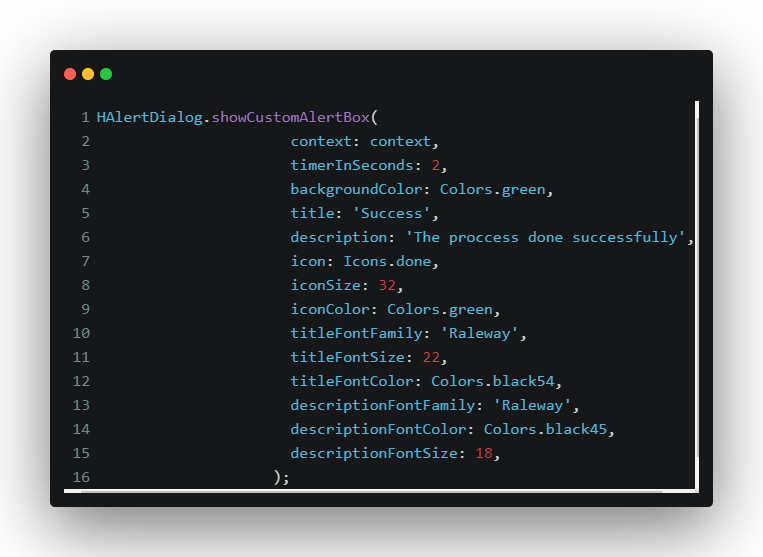

# h_alert_dialog

A new Flutter package project for simple and beautiful dialogs

## Usage

To use this package, add h_alert_dialog as a dependency in your pubspec.yaml file.
And add this import to your file.

import 'package:h_alert_dialog/h_alert_dialog.dart';

## ScreenShots
     
     

## Example

